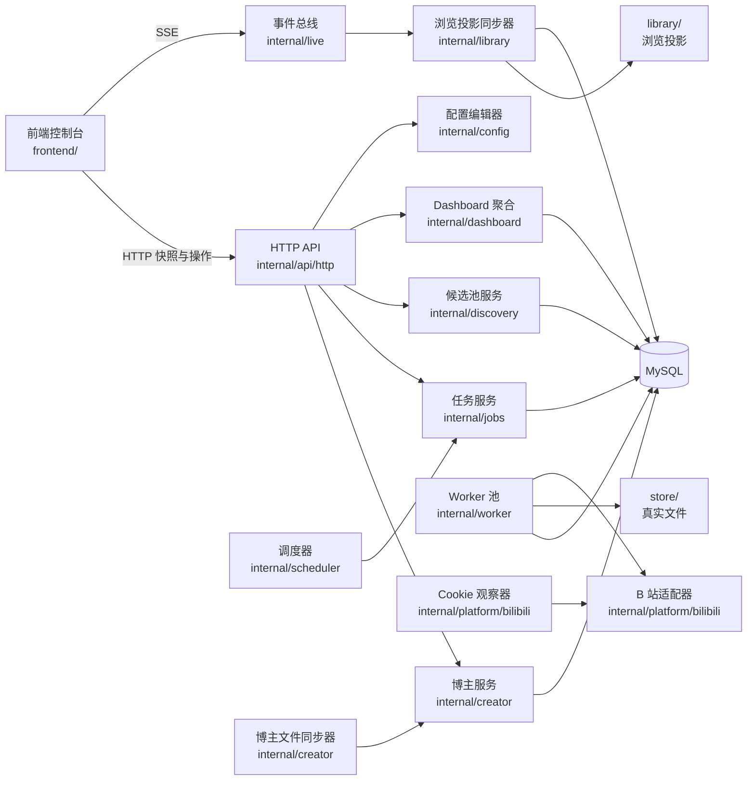

# 系统架构说明（当前实现）

## 1. 架构定位

本项目当前是一套面向单机部署的 B 站视频维护系统，核心目标不是“可扩到任
意平台的通用采集框架”，而是围绕当前已实现能力，稳定完成以下链路：

- 正式博主管理与文件同步。
- 新视频发现、下载、检查、清理。
- 候选池自动发现与人工审核转正。
- 前端控制台的实时状态查看与运维操作。
- 本地真实存储与 `library/` 浏览投影维护。

当前系统采用：

- 单个 Go 后端进程承载 HTTP API、调度、worker、启动恢复、配置写回与重
  启协同。
- 独立前端控制台通过 HTTP API + SSE 与后端通信。
- MySQL 作为业务真源数据库。
- 本地文件系统作为视频文件与浏览投影载体。
- 进程内事件总线用于状态广播和浏览目录增量重建。

## 2. 运行形态

### 2.1 进程与依赖

- 后端入口位于 `cmd/server`，启动时加载配置、构建应用并进入运行循环。
- 当前前端位于 `frontend/`，是独立构建的控制台应用，不嵌入 Go 二进制。
- 生产或本地容器部署通常表现为：
  - 一个后端服务进程
  - 一个 MySQL 实例
  - 一个独立前端静态服务容器
- 后端依赖本地 `storage.root_dir`，在其下维护：
  - `store/`：真实视频文件
  - `library/`：人工浏览投影目录

### 2.2 运行时组成

应用运行后，`internal/app` 会统一装配并启动以下组件：

- HTTP 路由与接口层
- 调度器（Scheduler）
- worker 池
- 候选池服务
- 博主文件同步器
- Cookie / SESSDATA 状态观察器
- 浏览投影同步器
- 进程内事件总线

这些组件在同一后端进程内协作，不存在独立消息队列、中间件总线或分布式节
点协调。

## 3. 主要组件

### 3.1 入口与应用装配

- `cmd/server/main.go`
  负责加载配置、处理系统信号，并在收到重启请求后重新加载配置再启动新一
  轮应用。
- `internal/app/app.go`
  负责数据库连接、自动迁移、仓储装配、服务装配、HTTP Server 创建、后台
  goroutine 启停与启动恢复。

这层是当前系统的真实“组合根”，也是理解整体依赖关系的第一入口。

### 3.2 HTTP API 与控制台接入层

- `internal/api/http/`
  提供博主管理、任务触发、视频查询、候选池审核、系统状态、配置读写、存
  储状态和 SSE 事件流接口。
- `frontend/src/`
  提供独立前端控制台，先加载快照，再订阅 `/events/stream` 增量事件。

前端与后端之间当前只有两类契约：

- HTTP 快照与操作接口
- SSE 实时事件

后端不承担前端渲染逻辑，也不把前端状态作为业务真源。

### 3.3 领域服务层

- `internal/creator/`
  负责博主新增、名称解析、状态更新、手工移除、文件同步与相关事件发布。
- `internal/discovery/`
  负责候选池发现、评分、审核流转、批准转正与批准后定向拉取。
- `internal/jobs/`
  负责任务入队、活动任务去重与 `job.changed` 事件发布。
- `internal/dashboard/`
  负责聚合系统总览、存储统计、Cookie / 风控状态与控制台快照数据。

这些服务层不直接暴露为独立进程，而是由 HTTP 层、调度器和 worker 共同复
 用。

### 3.4 调度与执行层

- `internal/scheduler/`
  负责按配置周期触发 `fetch`、`check`、`cleanup`、`discover` 任务。
- `internal/worker/`
  负责轮询任务仓储、并发消费任务，并执行拉取、下载、检查、清理、发现等
  具体逻辑。

当前调度与执行是“调度入队 + worker 消费”的模式，不是为每个视频建立独立
 定时器，也不是外部队列驱动。

### 3.5 平台适配层

- `internal/platform/bilibili/`
  封装 B 站相关能力，包括：
  - 视频列表读取
  - 可用性检查
  - 视频下载
  - 名称 / UID 解析
  - 关键词搜索与发现辅助
  - Cookie 校验与风控运行态

当前只有 B 站适配器。代码中虽存在若干接口边界，但不应将其理解为已经稳定
 的多平台插件架构。

### 3.6 数据访问与存储层

- `internal/repo/mysql/`
  负责 `creators`、`videos`、`video_files`、`jobs`、`candidate_creators`
  等实体的 MySQL 持久化。
- `internal/db/`
  负责 MySQL 连接与启动迁移。
- 本地文件系统
  负责真实视频文件与浏览投影目录。

当前的业务真源是 MySQL + `store/` 真实文件；`library/`、前端缓存和 SSE 事
件都属于派生层。

### 3.7 浏览投影与事件总线

- `internal/live/`
  提供进程内 `Broker`，向多个订阅者广播 `job.changed`、`video.changed`、
  `creator.changed`、`storage.changed`、`system.changed` 等事件。
- `internal/library/`
  负责把真实数据导出为按博主组织的 `library/` 浏览投影，并根据事件做增量
  重建，定期做全量对账。

这套机制的作用不是消息持久化，而是进程内状态传播和派生目录维护。

## 4. 核心数据流

### 4.1 启动、恢复与重启

1. `cmd/server` 读取配置并构建 `App`。
2. `App` 建立 MySQL 连接并执行自动迁移。
3. 装配仓储、B 站客户端、服务、调度器、worker、事件总线与浏览同步器。
4. 执行启动恢复：
   - 将 `running` 任务重新入队
   - 修复无活动下载支撑的 `DOWNLOADING` 视频
   - 修复文件缺失的 `DOWNLOADED` 视频
5. 启动前先重建一次 `library/` 浏览投影。
6. 并发启动调度器、worker、Cookie 观察器、博主文件同步器和 HTTP 服务。
7. 若配置写回请求触发重启，当前进程优雅关闭，外层循环重新加载配置并重
   启。

### 4.2 博主管理与文件同步

系统当前存在两条博主写入入口：

- HTTP 接口手工新增、修改、移除
- 博主文件定时同步

两条入口最终都收敛到 `creator.Service`：

- 新增或更新博主
- 名称解析 UID
- 文件移除时把博主自动置为 `paused`
- 手工删除时把博主置为 `removed`
- 已 `removed` 的博主不会被文件同步自动恢复

### 4.3 新视频发现与下载

1. 调度器或人工操作创建 `fetch` 任务。
2. `jobs.Service` 写入任务仓储，并对活动同类任务做去重。
3. worker 取出 `fetch` 任务，按博主读取最新视频列表。
4. 新视频写入 `videos` 表，状态初始化为 `NEW`。
5. 对新视频创建 `download` 任务。
6. worker 执行下载，将文件写入 `store/`，记录 `video_files`，并推进视频状
   态。
7. 状态变化通过事件总线广播给前端和浏览投影同步器。

### 4.4 下架检查与状态维护

1. 调度器或人工操作创建 `check` 任务。
2. worker 按视频或批量范围调用 B 站可用性检查。
3. 根据结果更新视频状态：
   - 不可访问 -> `OUT_OF_PRINT`
   - 超过稳定阈值仍可访问 -> `STABLE`
   - 其他情况保留或刷新现有状态
4. 需要发布变更时，由 `video.changed` 事件继续驱动前端与浏览投影刷新。

### 4.5 清理链路

1. 调度器或人工操作创建 `cleanup` 任务。
2. worker 扫描当前真实存储使用量。
3. 若超过安全阈值，从数据库中查询清理候选。
4. 先应用保留期过滤，再按当前策略排序：
   - 绝版优先保留
   - 粉丝量、播放量、收藏量越低越先被清理
   - 同优先级下再结合文件大小等因素打散
5. 删除真实文件、更新数据库状态，并发布存储变化事件。

### 4.6 候选池发现与人工审核

1. 调度器或人工操作创建 `discover` 任务。
2. worker 调用组合发现器：
   - 关键词发现
   - 一跳关系扩散
3. 发现结果写入 `candidate_creators`，并保存评分拆解与来源信息。
4. 前端控制台读取候选池列表与详情。
5. 人工批准后，候选转为正式博主；若开启配置，可再创建该博主的定向
   `fetch` 任务。

候选池是正式追踪池的上游补种链路，不直接等同于正式博主表。

### 4.7 前端快照与实时同步

1. 前端启动时并行拉取博主、任务、视频、系统状态、存储状态等快照。
2. 随后建立 `/events/stream` 的 SSE 连接。
3. 收到 `job.changed`、`video.changed`、`creator.changed`、
   `storage.changed`、`system.changed` 后增量更新本地状态。
4. 在连接重建、周期性对账或配置保存后恢复阶段，前端会重新拉取快照纠偏。

因此，前端一致性依赖“快照为准、事件增量补充”的双轨模式，而不是仅靠事件
流回放。

## 5. 当前架构边界

### 5.1 已确定的边界

- 当前只支持 B 站，不承诺多平台对等能力。
- 当前只支持单实例、单库、单机本地存储。
- 当前没有外部消息队列、对象存储或分布式 worker 集群。
- 当前配置真源是配置文件，不是数据库配置中心。
- 当前浏览投影 `library/` 是派生产物，不参与业务主决策。

### 5.2 不应误解的点

- 代码中存在接口抽象，不代表系统已经完成平台插件化设计。
- 独立前端控制台已经是当前架构一部分，不能再把系统描述成“仅后端服务”。
- 浏览投影同步器依赖进程内事件总线和定期对账，不是单次导出脚本。
- 配置在线保存后的“重启”是当前正式行为，不是临时开发方案。

## 6. 简化架构图

## 7. 相关文档

- 需求边界见 `docs/requirements.md`
- Go 目录结构见 `docs/go-structure.md`
- 接口定义见 `docs/api.md`
- 配置语义见 `docs/config.md`
- worker 细节见 `docs/worker.md`
- 调度规则见 `docs/job-scheduler.md`
- 存储与清理规则见 `docs/storage-policy.md`
