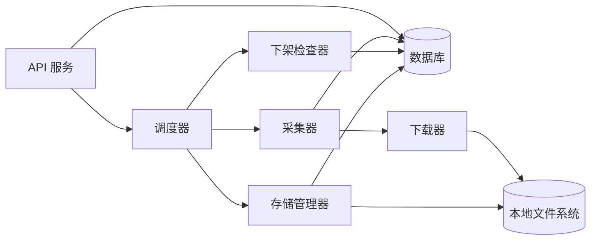

# 系统架构说明

## 1. 总览
系统采用单后端服务，拆分为调度、采集、下载、检查、清理等模块。后续可通过“平台适配器”扩展到其他平台。

## 2. 组件划分
- API 服务：提供管理接口（博主、视频、任务、配置、统计）。
- 调度器（Scheduler）：周期性触发采集、下架检查与清理任务。
- 采集器（Fetcher）：获取博主视频列表与元数据。
- 下载器（Downloader）：下载视频与封面、字幕等资源。
- 下架检查器（Availability Checker）：检测视频是否可访问。
- 存储管理器（Storage Manager）：执行容量评估与清理策略。
- 数据库（DB）：保存博主、视频、任务与状态。
- 文件系统（FS）：保存视频与关联文件。

## 3. 数据流
### 3.1 新视频发现与下载
1) Scheduler 触发博主采集任务。
2) Fetcher 拉取博主视频列表，与 DB 去重。
3) 发现新视频 → 生成下载任务。
4) Downloader 拉取视频与资源，写入 FS。
5) 更新视频状态与元数据。

### 3.2 下架检测
1) Scheduler 触发待检查视频集合。
2) Availability Checker 检测访问状态。
3) 下架 → 标记 `OUT_OF_PRINT`，记录时间。
4) 未下架且超过阈值 → 标记 `STABLE`。

### 3.3 存储清理
1) Storage Manager 计算当前使用量。
2) 超过阈值 → 按策略排序待删视频。
3) 删除文件 → 更新 DB 状态为 `DELETED`。

## 4. 模块依赖与扩展点
- 平台适配器接口：统一抽象 `list_videos`、`get_video_meta`、`download_video`、`check_available`。
- 后续平台（抖音/快手/小红书）通过实现适配器接入。

## 5. 架构图（简化）

## 6. 技术选型建议（可调整）
- 语言与框架：Go（goroutine + worker pool），适合高并发 I/O 任务。
- DB（建议）：MySQL
  - 原因：强一致性、关系约束与复杂查询更适合任务调度与状态机。
  - 统计类字段可用 JSON 或专用列存储并建索引。
- DB（可选）：MongoDB
  - 适合元数据结构变化频繁的场景，但调度与事务一致性成本更高。
- 调度：内置任务调度（cron-like）+ 任务队列（可自研或轻量实现）。
